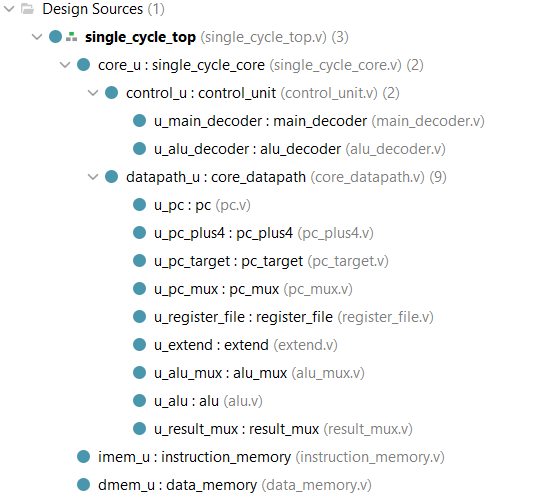
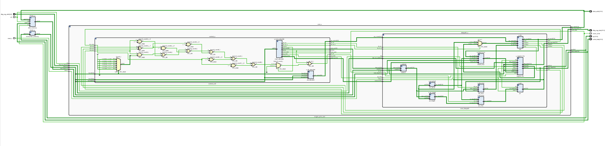

# 32-Bit Single-Cycle RISC-V Processor


## 📌 Project Overview
This repository contains a fully synthesized **Register-Transfer Level (RTL)** implementation of a 32-bit Single-Cycle RISC-V Processor. Designed strictly according to the **RV32I Base Integer Instruction Set Architecture**, this core executes distinct instructions—from fetch to write-back—in a single clock cycle.

The project demonstrates a rigorous modular hardware design approach, separating the Control Unit from the Datapath, and serves as a foundational project for understanding processor microarchitecture.

## ✨ Key Features
* **ISA Compliance:** Supports the core RISC-V RV32I instruction set (Arithmetic, Logical, Memory, Branching).
* **Harvard Architecture:** Separate **Instruction Memory (IMEM)** and **Data Memory (DMEM)** interfaces.
* **Modular Design:** Hierarchical Verilog modules for easier debugging and synthesis.
* **Synthesizable:** Written in clean, synthesizable Verilog suitable for FPGA implementation (e.g., Artix-7).
* **Self-Checking Verification:** Validated using a robust testbench infrastructure.

---

## 🏗️ Architecture & Design

### 1. Conceptual Datapath
The architecture follows the standard single-cycle implementation as described in the reference textbook *Digital Design and Computer Architecture: RISC-V Edition*. The diagram below illustrates the flow of data through the Control Unit, ALU, Register File, and Memory interfaces.


### 2. Vivado Design Hierarchy
The design is structured hierarchically to ensure clean separation of concerns. This structure corresponds directly to the design hierarchy used in verification and synthesis.



### 3. Synthesized Logic (RTL Schematic)
The design was successfully synthesized in Xilinx Vivado. The schematic below visualizes the gate-level implementation and the connections between the `control_unit`, `datapath_unit`, and memory modules.



---

## 📂 Repository Structure

```text
├── rtl/                         # All Synthesizable Design Files
│   ├── top/
│   │   └── single_cycle_top.v   # Top-level wrapper
│   ├── core/
│   │   ├── single_cycle_core.v
│   │   ├── control_unit/        # Control Logic
│   │   │   ├── control_unit.v
│   │   │   ├── main_decoder.v
│   │   │   └── alu_decoder.v
│   │   └── datapath/            # Datapath Components
│   │       ├── core_datapath.v
│   │       ├── pc.v
│   │       ├── register_file.v
│   │       ├── alu.v
│   │       └── ... (muxes, extenders, etc.)
│   ├── memory/                  # Memory Modules
│   │   ├── instruction_memory.v
│   │   └── data_memory.v
├── tb/                          # Simulation Testbenches
│   ├── single_cycle_tb.v        # Top-Level Testbench
└── README.md
```
---

## ⚙️ Instruction Set Support
The processor implements the following subsets of the **RV32I** instruction set:

| Type | Instructions Implemented | Description |
| :--- | :--- | :--- |
| **R-Type** | `ADD`, `SUB`, `AND`, `OR`, `XOR`, `SLT`, `SLTU`, `SLL`, `SRL`, `SRA` | Register-Register Arithmetic & Logic |
| **I-Type** | `ADDI`, `ANDI`, `ORI`, `XORI`, `SLTI`, `SLTIU`, `LB`, `LH`, `LW`, `JALR`, `SLLI`, `SRLI`, `SRAI` | Immediate Arithmetic, Loads, Jump Reg |
| **S-Type** | `SB`, `SH`, `SW` | Store Operations (Byte, Half, Word) |
| **B-Type** | `BEQ`, `BNE`, `BLT`, `BGE`, `BLTU`, `BGEU` | Conditional Branching |
| **U-Type** | `LUI`, `AUIPC` | Upper Immediate Operations |
| **J-Type** | `JAL` | Unconditional Jumps |

---

## 🔧 Simulation & Verification

The design has been verified using a **Self-Checking Testbench**.

**Testbench Location:** `tb/single_cycle_tb.v`

**Simulation Strategy:**
The testbench loads a hex file containing machine code into the Instruction Memory and monitors the CPU state at every clock edge. It compares the state of the processor against expected results to verify correctness.

**Steps to Run:**
1.  **Launch Simulator:** Open Vivado (or ModelSim/Icarus).
2.  **Add Files:** Add all files from the `rtl/` directory and the `tb/` directory.
3.  **Set Top Module:** Set `single_cycle_tb` as the **Top Module** for simulation.
4.  **Load Program:** Ensure the testbench is pointing to the correct hex file (usually defined in `instruction_memory.v` or via `$readmemh`).
5.  **Run:** Run Behavioral Simulation for 1000ns (or until the program halts).
6.  **Verify:** Check the waveform for the `Zero` flag and `ALUResult` to confirm the instructions are executing as expected.

---

## 🚀 Future Scope
* **Pipelining:** Convert the single-cycle design into a **5-stage pipeline** (IF, ID, EX, MEM, WB) to improve clock frequency and instruction throughput.
* **Hazard Handling:** Implement Forwarding and Stalling units to resolve data and control hazards in the pipelined version.
* **FPGA Implementation:** Synthesize the design for a Xilinx Artix-7 FPGA and map the I/O to board switches and LEDs.
* **Peripheral Integration:** Add support for UART or SPI protocols to enable communication with external devices.

---

## 📚 References
* **Primary Text:** *Digital Design and Computer Architecture: RISC-V Edition* by Sarah L. Harris and David Harris.
* **ISA Specification:** *The RISC-V Instruction Set Manual, Volume I: Unprivileged ISA*.

---

## 👨‍💻 Author
**Sumit Kumar Sengar**
* B.Tech in Electronics and Communication Engineering
* Delhi Technological University (DTU)
